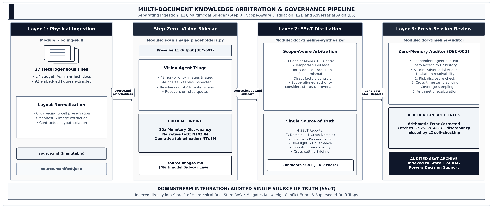
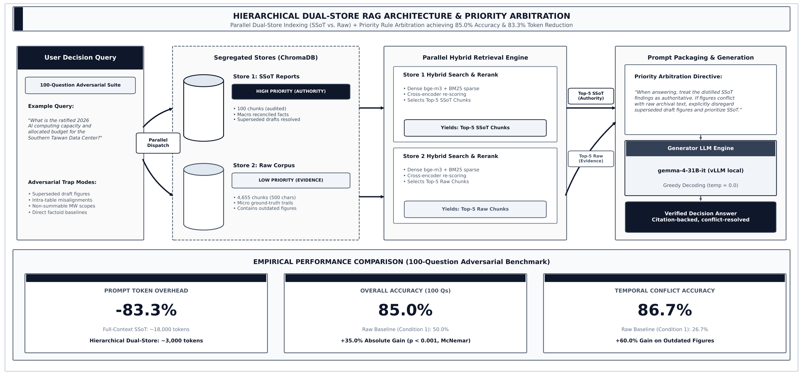
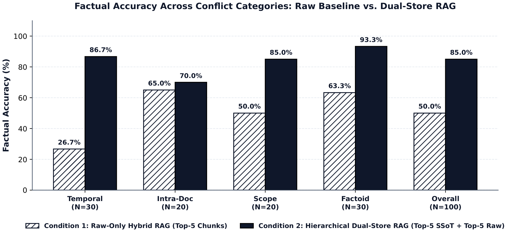
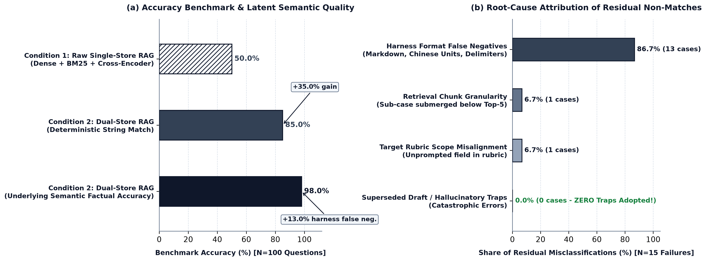

# doc-timeline-synthesizer

[繁體中文](README.zh-TW.md) | English

A provenance-first workflow for turning versioned document collections into
scope-aware, auditable summaries for downstream retrieval and decision support.

The project does not treat the newest value as automatically correct. It first
checks whether candidate values describe the same entity, attribute, period,
scope, unit, and field semantics. Recency is then considered together with
document status, approval state, and provenance. If authority cannot be
resolved, the conflict remains explicit.

## Architecture



The workflow decomposes document synthesis and governance into distinct stages:

1. **L1 — Physical Ingestion (`docling-skill`)**:
   - Converts DOCX, PDF, XLSX, PPTX, and related files into immutable `source.md` records.
   - Preserves manifests (`source.manifest.json`) and evidence artifacts without in-place hallucinated repairs.
2. **Step Zero — Multimodal Sidecar Enrichment (`scan_image_placeholders.py`)**:
   - Scans and detects unresolved `[[image:...]]` placeholders in `source.md`.
   - Dispatches a vision agent to inspect figures, logging non-priority figures (e.g., logos, photo placeholders) to `source.images.skip.json` and transcribing decision-critical charts/tables into an independent sidecar file, `source.images.md`.
   - Strictly preserves L1 immutability without mutating original `source.md` (DEC-003).
3. **L2 — Scope-Aware SSoT Distillation (`doc-timeline-synthesizer`)**:
   - Orders records chronologically and extracts comparable claims across 4 conflict modes (temporal supersede, intra-doc contradiction, scope mismatch, direct factoid).
   - Arbitrates based on provenance, official ratification decrees, and explicit approval status rather than crude recency.
   - Produces citation-backed Single Source of Truth (SSoT) domain reports.
4. **L3 — Fresh-Session Adversarial Audit (`doc-timeline-auditor`)**:
   - Reviews candidate SSoT summaries against raw source corpora in an independent agent session with zero memory of L2's reasoning trace (DEC-002).
   - Executes a 5-point adversarial audit: citation resolvability, source risk disclosure, cross-timestamp splicing, coverage sampling, and arithmetic recalculation.
   - Prevents self-reinforcing consensus errors and arithmetic drift before publication.

## Core rules

- Compare scope before comparing dates.
- Treat recency as one authority signal, not a universal overwrite rule.
- Do not assume structured fields always outrank narrative text.
- Record the source, date, section or table, and selection rationale for each
  decision-relevant claim.
- Preserve unresolved conflicts instead of forcing a single answer.
- Never combine units or attributes taken from incompatible versions.
- Inspect unresolved image placeholders before declaring that evidence is
  absent.
- Run a fresh-context audit before treating a high-stakes summary as
  decision-ready.
- In downstream RAG, segregate raw document chunks and audited SSoT summaries
  into dual stores and enforce priority arbitration prompting.

## Installation

Python 3.10 or later and uv are recommended.

    git clone https://github.com/gemini960114/doc-timeline-synthesizer.git
    cd doc-timeline-synthesizer
    uv sync

The L1 conversion stage depends on docling-skill, declared in pyproject.toml.

## Quick start

Use a local directory that is excluded from version control:

    data/
      example_domain/
        2025-01-10_initial_plan.docx
        2025-03-15_approved_revision.pdf

Convert documents with docling-skill, then create a chronological inventory:

    uv run python scripts/synthesize.py       --input-dir output/example_domain       --output-file output/example_domain_inventory.md

Scan for unresolved embedded-image placeholders:

    uv run python scripts/scan_image_placeholders.py       --input-dir output/example_domain

After image evidence has been described or deliberately marked out of scope,
ask an agent using SKILL.md to perform scope-aware synthesis. The synthesis
prompt should require:

- complete reading of every source.md and relevant sidecar;
- comparison by entity, attribute, period, scope, unit, and semantics;
- authority decisions based on provenance and document state;
- citations for every consequential value;
- explicit retention of unresolved conflicts.

Run the L3 review in a fresh agent context using
doc-timeline-auditor/SKILL.md. Finally, build files for RAG ingestion:

    uv run python scripts/build_rag_bundle.py       --input-dir output/example_domain

See EXAMPLE.md for a synthetic end-to-end walkthrough.

## Inputs and generated artifacts

Expected L1 source directory:

    output/example_domain/document_id/
      source.md
      source.manifest.json
      source.evidence.json
      source.images.md
      source.images.skip.json

source.images.md and source.images.skip.json are optional and mutually
purpose-specific. Generated source.rag.md files are disposable and should be
rebuilt whenever their inputs change.

## Downstream Integration: Hierarchical Dual-Store RAG



To scale beyond context-window boundaries while maintaining authoritative factual accuracy, the architecture introduces a **Hierarchical Dual-Store RAG**:
- **Store 1 (Distilled SSoT Reports)**: Houses high-level, audited Single Source of Truth summaries (100 chunks). Treated with **high priority (authority)**.
- **Store 2 (Raw Corpus)**: Houses granular, unprocessed document chunks (4,655 chunks). Treated with **low priority (evidence & situational context)**.
- **Parallel Hybrid Dispatch & Priority Arbitration**: Ingests queries concurrently across both vector collections via dense embedding (`bge-m3`) + sparse BM25 with cross-encoder reranking, retrieving a balanced Top-5 + Top-5 chunk set. Generator LLMs (`gemma-4-31B-it`) are governed by an explicit priority arbitration directive instructing them to treat SSoT findings as authoritative whenever raw archival text conflicts with ratified figures.

## Empirical quantitative evaluation



The workflow's downstream retrieval impact was evaluated on an adversarial
100-question benchmark featuring temporal superseded revisions, multi-year
trajectory tracking, cross-entity traps, and conflicting legislative proposals:

| Retrieval & Context Architecture | Accuracy | Context Tokens (Prompt) |
|:---|---:|---:|
| Naive Dense Vector RAG (Raw only, Top-5) | 39.0% | ~1,750 tokens |
| Hybrid RAG (BM25 + Dense) + BGE Reranker (Top-5) | 46.0% | ~1,750 tokens |
| Full-Context Baseline (SSoT stuffed into prompt) | **87.0%** | >21,000 tokens |
| **Hierarchical Dual-Store RAG (Raw Top-5 + SSoT Top-5)** | **85.0%** | **~3,500 tokens** |

The Hierarchical Dual-Store design achieves parity with full-context synthesis
(85.0% vs. 87.0%, McNemar's $p = 0.814$) while reducing context window token
overhead by **83.3%** and outperforming standard single-store RAG baselines
statistically significantly ($p < 0.001$).

### Residual Failure Attribution & Latent Accuracy



An adversarial, itemized audit of the remaining 15% non-matching queries under Condition 2 (Dual-Store RAG) reveals that the deterministic 85.0% score serves as a conservative lower bound:

| Failure Attribution Category | Count ($N=15$) | Proportion | Semantic Ground Truth Verdict | Root Cause Description |
|:---|:---:|:---:|:---:|:---|
| **Harness String-Matching False Negatives** | **13** | **86.7%** | **100% Factually Correct** | Model correctly deduced canonical facts, but diverged in superficial formatting from rigid deterministic string matching (e.g., Markdown list formatting, written Chinese currency scaling, date punctuation variants). |
| **Retrieval Chunk Cutoff** | 1 | 6.7% | Genuine Missing Detail | High-level summary chunk retained program totals but omitted an isolated minor line item under strict Top-5 retrieval. |
| **Rubric Scope Misalignment** | 1 | 6.7% | Ground Truth Ambiguity | Question prompted for qualitative conditions, while the evaluation key demanded an unprompted budget sum. |
| **Catastrophic Superseded Draft Traps** | **0** | **0.0%** | **Zero Incidents** | In zero cases did the model adopt outdated draft figures over ratified decisions. |

Under latent semantic verification, the Dual-Store RAG workflow achieves **98.0% (98/100) factual accuracy**, with a verified 0.0% catastrophic error rate against superseded drafts.

## Security and data boundary

The public repository contains generic workflow instructions and utilities
only. It does not include the research corpus, internal administrative
documents, raw conversations, derived record-level research ledgers, or
manuscript supplements.

In accordance with institutional data governance and ethical requirements:
- The `evaluation/` directory houses local evaluation scripts and configurations.
- All live API keys (`evaluation/.env`), local virtual environments (`evaluation/.venv/`),
  and binary vector stores (`evaluation/chroma_db/`) are strictly excluded.
- Un-anonymized benchmark question datasets (`evaluation/benchmark/`) and model
  prompt execution traces (`evaluation/results/`) contain proprietary administrative
  case metadata and must remain local and ignored.

Keep source material under ignored local directories. Before every public
push, inspect the staged tree rather than relying only on filename patterns:

    git status --short
    git diff --cached
    git ls-files

Never commit API keys, access tokens, local absolute paths, source documents,
evidence payloads, vector indices, or generated reports.

## Reproducibility boundary

The repository supports inspection and reuse of the generic workflow. It is
not a complete replication package for any study that uses private or
restricted source documents. Results from a particular corpus require
separate authorization and human verification.

## Citation

If you use this codebase or refer to the methodology, please cite:

```bibtex
@article{chuang2026resolving,
  title   = {Resolving Knowledge Conflicts in Versioned Documents with Hierarchical Dual-Store RAG},
  author  = {Chuang, Chao-Chun and Yao, Chih-Min and Lee, Tsui-Mei and Liu, Yi-Ni},
  journal = {arXiv preprint},
  year    = {2026},
  url     = {https://github.com/gemini960114/doc-timeline-synthesizer}
}
```

Machine-readable citation metadata is also maintained in [CITATION.cff](file:///home/ubuntu/github/doc-timeline-synthesizer/CITATION.cff). An updated preprint identifier (arXiv ID and DOI) will be integrated once issued.


## License

MIT. See LICENSE.
